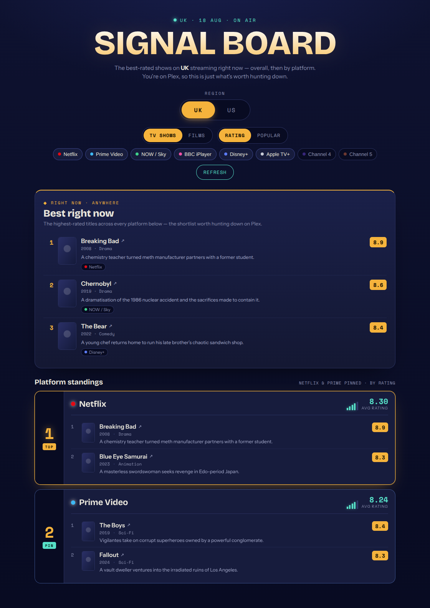

# Signal Board

The best-rated TV shows, films, and documentaries on IMDb — a *discovery board* for what's worth hunting down.

All data comes from **[IMDb's public non-commercial datasets](https://datasets.imdbws.com)** — free, no API key, no account. A build script downloads and filters them into a small JSON snapshot bundled with the app.



## Features

- **Top rated** — the highest IMDb-rated titles, with a minimum vote-count floor so obscure, small-fanbase titles don't crowd out things people have actually heard of.
- **Sort by Rating / Popular** — Rating is all-time by IMDb score; Popular approximates "hot right now" as titles from a selectable recent window (this year / 2 / 5 / 10 years / all time) ranked by vote count (IMDb has no live trending signal, unlike some commercial APIs — and no exact release date either, so "duration" can only bucket by year).
- **TV / Films** toggle, and a **Docs** toggle that filters to the Documentary genre.
- **One-sentence plot descriptions**, fetched live from OMDb for just the titles on screen (optional — see below).
- **Streaming service flag** — the most well-known UK service each title is currently on (Netflix, BBC iPlayer, etc.), fetched live from Watchmode for just the titles on screen (optional — see below). It's a fixed "how well-known is this service" ranking, not a measurement of where that specific title is most-watched — no API tracks that.

## Stack

Next.js 14 (App Router) · React 18 · TypeScript. No database, no cache layer — the IMDb dataset is small enough to query in-memory per request. OMDb and Watchmode are the two optional live external calls, used only for plot text and the streaming flag respectively.

## Getting started

```bash
npm install
npm run build:imdb   # downloads + bakes lib/imdb-data.json (~7MB, takes a minute)
npm run dev           # http://localhost:3000
```

No environment variables are required for the core board. Optionally set `OMDB_API_KEY` and/or `WATCHMODE_API_KEY` (see below) for plot descriptions and the streaming flag.

## How it works

```
Browser (components/SignalBoard.tsx)
   │  POST /api/board  { mediaType, sortBy, docsOnly, popularWindow }
   ▼
Server route (app/api/board/route.ts)
   │  lib/board.ts: filter + sort lib/imdb-data.json in-memory
   │     → lib/omdb-client.ts: fetch a one-sentence plot per shown title
   │     → lib/watchmode-client.ts: fetch the top UK streaming flag per shown title
   ▼
{ titles[] }  →  rendered into the board
```

- `scripts/build-imdb-data.mjs` downloads `title.basics.tsv.gz` + `title.ratings.tsv.gz` from `datasets.imdbws.com`, joins them on `tconst`, filters to non-adult movies/TV series with at least 1,000 votes, and writes `lib/imdb-data.json`.
- `lib/board.ts` applies the actual ranking at request time: a higher vote floor (10,000) for Rating mode to keep results credible, a recent-window + vote-count sort for Popular mode, and a genre filter for Docs mode.
- `lib/omdb-client.ts` fetches a plot for just the ~10 titles being returned (not the whole dataset — OMDb's free tier is 1,000 req/day, nowhere near enough to backfill 60k+ titles), and caches each result in memory for the life of the server process. Missing key or a failed lookup just means no description, not an error.
- `lib/watchmode-client.ts` fetches UK streaming sources for the same ~10 titles (Watchmode's `/title/{imdbId}/sources` takes the IMDb ID directly — no extra lookup step), filters to subscription/free sources, and picks the best-known one via a fixed priority list (Netflix, Prime Video, Disney+, BBC iPlayer, ...). Same in-memory cache, same graceful degrade to no flag if the key's missing or nothing matches.
- Discovery/ranking has no live external call and nothing to cache or warm — re-run `npm run build:imdb` whenever you want fresher data (IMDb updates its source files daily).

## Optional: plot descriptions (OMDb) & streaming flag (Watchmode)

1. OMDb: get a free key at <https://www.omdbapi.com/apikey.aspx> (OMDb emails a confirmation link — the key won't work until you click it). Set `OMDB_API_KEY`.
2. Watchmode: get a free key at <https://api.watchmode.com>. Set `WATCHMODE_API_KEY`.

Either can be set independently in `.env.local`. Without them, titles just render without a description and/or service flag — everything else works the same.

## Project structure

```
app/
  layout.tsx           root layout + font links
  page.tsx              renders the board
  globals.css           all styling
  api/board/route.ts    board endpoint (in-memory query + OMDb/Watchmode enrichment)
components/
  SignalBoard.tsx        the client UI
lib/
  board.ts               filters/sorts lib/imdb-data.json
  imdb-data.json          baked snapshot (generated — see scripts/build-imdb-data.mjs)
  omdb-client.ts          fetches + caches one-sentence plots
  watchmode-client.ts     fetches + caches the top UK streaming service flag
  types.ts                shared types
scripts/
  build-imdb-data.mjs     downloads IMDb datasets, writes lib/imdb-data.json
```

## Deploy (Vercel)

1. Run `npm run build:imdb` locally and commit `lib/imdb-data.json` (or run it as a build step).
2. Push to GitHub and import into Vercel.
3. Optionally add `OMDB_API_KEY` and/or `WATCHMODE_API_KEY` as environment variables.
4. Deploy.

## Notes & caveats

- No poster images — IMDb's non-commercial dataset doesn't include them, and OMDb's poster field isn't used here.
- "Popular" is an approximation (recent-window + vote count), not a real trending signal, and its duration picker is year-only — IMDb's dataset has no month/day.
- The streaming flag is UK-only, a single "most well-known" service (not the full availability list), and is a fixed priority ranking of services — not a real "which platform is this title most popular on" measurement, which no API provides.
- Core data is a static snapshot from whenever `build:imdb` was last run, not live. Plot descriptions and the streaming flag are the two things fetched live, per-title, on each board load.

## Attribution

This product uses IMDb data but is not endorsed or certified by IMDb. Datasets used under IMDb's [non-commercial licensing terms](https://developer.imdb.com/non-commercial-datasets/). Plot text via OMDb. Streaming availability via Watchmode.

## Possible next steps

- Pull poster images from a secondary source.
- Add a genre filter beyond just Documentary.
- Remember last sort/media-type selection (localStorage).
